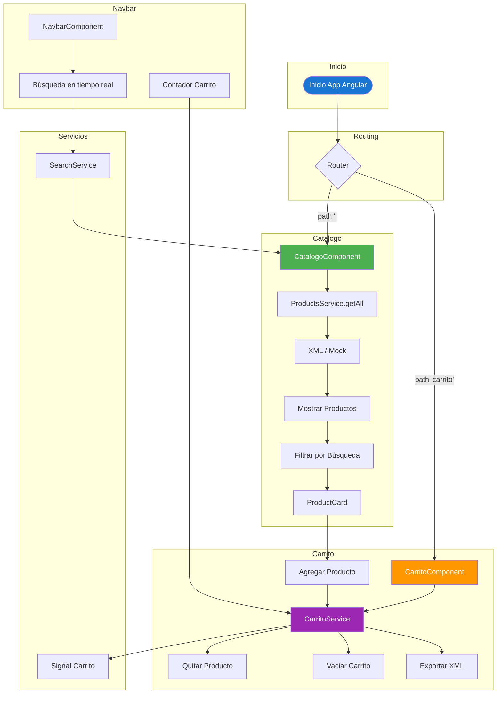

# Diagrama de Flujo - Aplicación de Catálogo

```mermaid
flowchart TD
    subgraph "Inicio"
        A([Inicio App Angular])
    end
    
    subgraph "Routing"
        B{Router}
    end
    
    subgraph "Catalogo"
        C[CatalogoComponent]
        D[ProductsService.getAll]
        E[XML / Mock]
        F[Mostrar Productos]
        G[Filtrar por Búsqueda]
        H[ProductCard]
    end
    
    subgraph "Navbar"
        I[NavbarComponent]
        J[Búsqueda en tiempo real]
        K[Contador Carrito]
    end
    
    subgraph "Carrito"
        L[CarritoComponent]
        M[CarritoService]
        N[Agregar Producto]
        O[Quitar Producto]
        P[Vaciar Carrito]
        Q[Exportar XML]
    end
    
    subgraph "Servicios"
        R[SearchService]
        S[Signal Carrito]
    end
    
    A --> B
    B -->|path ''| C
    B -->|path 'carrito'| L
    
    C --> D
    D --> E
    E --> F
    F --> G
    G --> H
    
    I --> J
    J --> R
    R --> C
    
    K --> M
    M --> S
    
    H --> N
    N --> M
    
    L --> M
    M --> O
    M --> P
    M --> Q
    
    style A fill:#1976d2,color:#fff
    style C fill:#4caf50,color:#fff
    style L fill:#ff9800,color:#fff
    style M fill:#9c27b0,color:#fff
```
