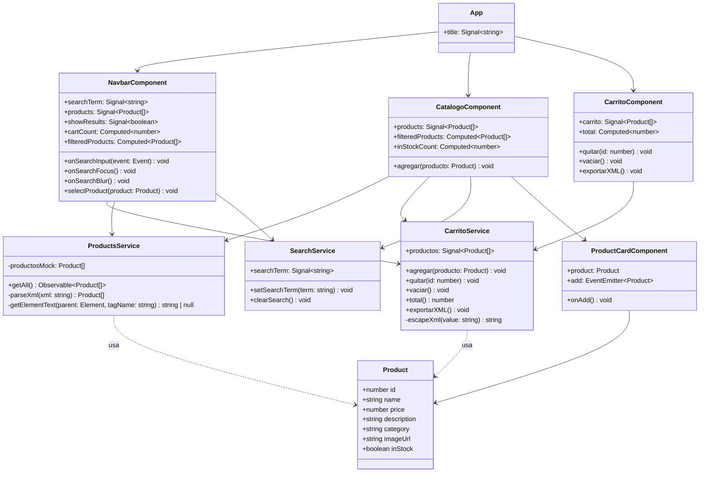
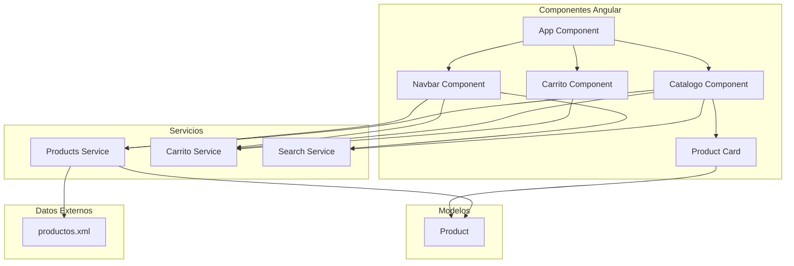
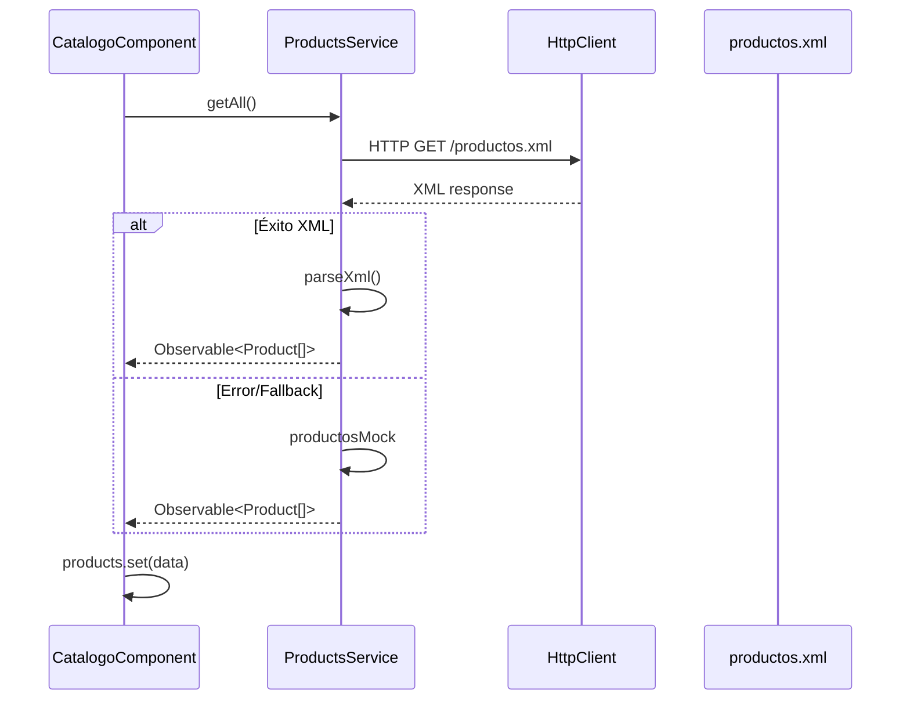

# UML - Diagrama de Clases



---

## UML - Diagrama de Componentes



---

## UML - Diagrama de Secuencia (Agregar al Carrito)

```mermaid
sequenceDiagram
    participant U as Usuario
    participant PC as ProductCard
    participant CC as CatalogoComponent
    --> CS as CarritoService
    participant N as Navbar
    
    U->>PC: Click "Agregar"
    PC->>CC: add.emit(product)
    CC->>CS: agregar(producto)
    CS->>CS: productosSignal.update()
    CS-->>CC: Signal actualizado
    CS-->>N: Signal actualizado
    N-->>U: Contador carrito se actualiza
```

---

## UML - Diagrama de Secuencia (Carga de Productos)


